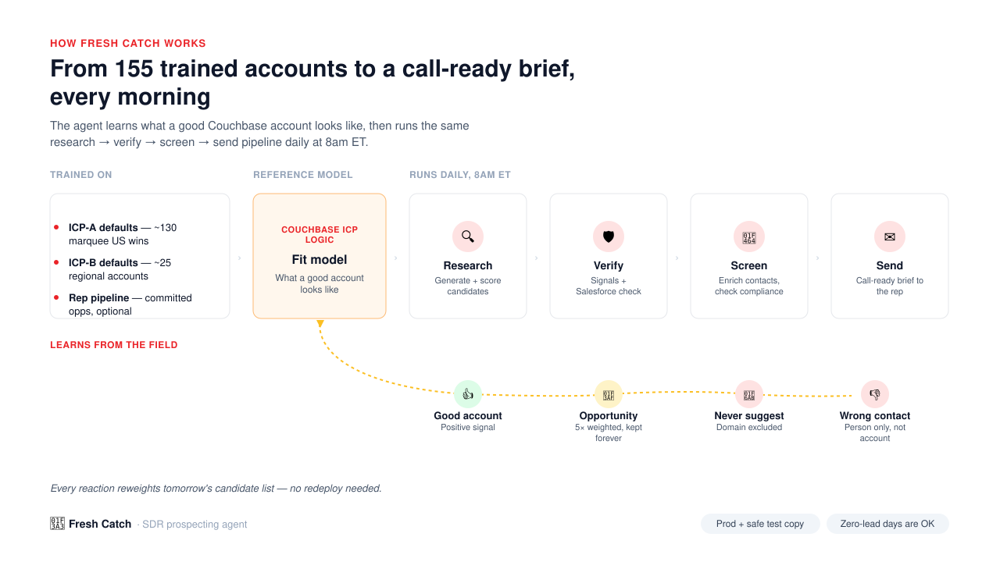

# 🎣 Fresh Catch Feedback

A tiny static redirect page that turns a click in a **Fresh Catch** email into a recorded rep signal.

Fresh Catch is Couchbase's automated daily prospecting agent — it emails each AE a call-ready brief of net-new companies to target. Every company and contact card in that email has 👍 🎯 🚫 👎 buttons. This repo is what those buttons point to.

## What it does

`index.html` is served via GitHub Pages. When a rep clicks a feedback button:

1. The link lands here with query params (`rating`, `domain`, `rep`, and optionally `contact_name` / `contact_email` / `contact_linkedin` for contact-level DQ).
2. The page shows a friendly confirmation card and closes the loop — no login, no app to open.
3. In the background, it sends the rating to the **🎣 Fresh Catch Feedback** Rox agentflow, which persists it to a shared org-scoped store.
4. The next day's Fresh Catch run reads that store and personalizes its research — biasing toward accounts like the ones a rep liked, hard-excluding ones they blocked, and skipping contacts they DQ'd.

Test-mode links (from Fresh Catch's preview/test emails) include `test=1`, which short-circuits the write so test clicks never pollute production feedback.

## Rating types

| Button | Rating | Effect |
|---|---|---|
| 👍 Good account | `good` | Positive taste signal |
| 🎯 Opportunity | `opportunity` | Strongest positive signal, kept forever |
| 🚫 Never suggest | `not_relevant` | Domain hard-excluded going forward |
| 👎 DQ contact | `dq_contact` | Contact excluded; account stays eligible |

## Docs

Full specs for both agents in this system live in [`docs/`](docs):

- [`FRESH_CATCH_DESIGN.md`](docs/FRESH_CATCH_DESIGN.md) — the daily prospecting agent that generates and sends the brief
- [`FRESH_CATCH_FEEDBACK_DESIGN.md`](docs/FRESH_CATCH_FEEDBACK_DESIGN.md) — the webhook agent this page reports to

## Owner

Mel Boulos (Couchbase)
