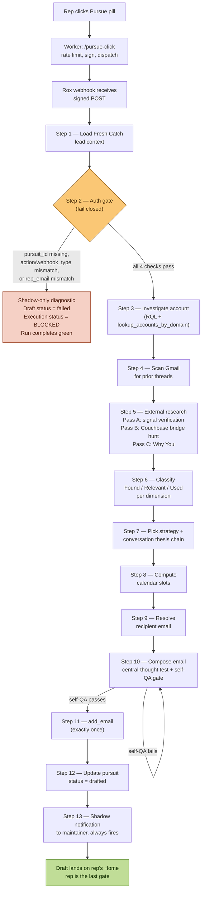

# 🎣 Fresh Catch Pursue — Technical Design Document

**Version:** 1.0
**Last updated:** 2026-09-10
**Owner:** Mel Boulos (mel.boulos@couchbase.com)
**Rox workflow:** 🎣 Fresh Catch Pursue
**Trigger URL:** https://webhooks.backend.rox.com/webhooks/w/workflow-webhook-df351a15
**Kind:** Agentflow

---

## 1. Purpose

When a rep clicks the 🎯 Pursue pill on a Fresh Catch lead, this workflow retrieves the persisted lead context, investigates current account/relationship/calendar state, drafts a highly-personalized first-touch email on the rep's behalf, and lands it on their Rox Home for review.

**The workflow never sends the email. The rep is the last gate.**

**Guiding principle.** Every pursuit is a hypothesis-driven investigation, not a template fill-in. The email exists to earn a conversation that will validate or kill the Couchbase hypothesis — not to prove the hypothesis prematurely. Search deeply, include selectively, and never equate "I looked and found nothing" with "I didn't look."

---

## 2. End-to-end architecture

```
┌───────────────────────┐
│  Fresh Catch email    │  Daily digest email in rep's inbox.
│  (generator agentflow)│  Renders 🎯 Pursue pill per lead.
└──────────┬────────────┘
           │  Rep clicks 🎯 Pursue
           ▼
┌───────────────────────────────────────────────────┐
│  Static shim (index.html, reusing the shared      │
│  deep_dive_feedback Worker infra) at               │
│  https://<pages-host>/fresh_catch_pursue/)        │
│  reads query params, POSTs JSON to Worker.        │
│  [FUTURE — currently pill goes direct to Worker]  │
└──────────┬────────────────────────────────────────┘
           │  Currently: pill → /pursue-click (GET)
           ▼
┌───────────────────────────────────────────────────┐
│  Cloudflare Worker                                │
│  rox-deep-dive-proxy.mel-boulos-97e.workers.dev   │
│    /pursue-click   GET  → per-rep dispatch        │
│    /pursue-webhooks.json GET → who has Pursue     │
│    /admin          GET  → basic-auth admin UI     │
│    /admin/save     POST → upsert rep in KV        │
│  KV: ROX_ROUTING (rep_email → pursue_webhook_url, │
│                    pursue_signing_key, booking_url│
│                    Deep Dive webhook_url)         │
│  Validates action + webhook_type + pursuit_id.    │
│  Rate-limits per IP.                              │
│  Signs Rox request via Bearer <signing_key>.      │
│  POSTs canonical JSON to Rox webhook.             │
│  Renders HTML confirmation to browser.            │
└──────────┬────────────────────────────────────────┘
           │  POST (signed) with JSON body
           ▼
┌───────────────────────────────────────────────────┐
│  Rox webhook                                      │
│  webhooks.backend.rox.com/…/workflow-webhook-…    │
│  → triggers this agentflow                        │
└──────────┬────────────────────────────────────────┘
           │  trigger_data.payload = { action, webhook_type,
           │                           pursuit_id, rep_email,
           │                           contact_email?, booking_url?,
           │                           clicked_at?, test? }
           ▼
┌───────────────────────────────────────────────────┐
│  Fresh Catch Pursue agentflow (this document)     │
│  Steps 1–13. Runtime: ~3–5 minutes.               │
└──────────┬────────────────────────────────────────┘
           │
           ├─► add_email → rep's Rox Home (draft)
           ├─► custom_store_set → pursuit status = "drafted"
           └─► send_notification → maintainer's inbox (shadow diagnostic)
```

> **Note on `deep_dive_feedback`:** the Cloudflare Worker (`rox-deep-dive-proxy`) that dispatches Pursue clicks is shared infrastructure originally built for the Deep Dive project. Fresh Catch Pursue reuses it rather than running its own Worker. `deep_dive_feedback` does not own or host this project — it just provides the Worker this pill happens to route through.

---

## 3. Trigger contract

**Trigger type:** webhook (POST, JSON)
**Authentication:** Signature verified at Rox ingress. Signing key is per-rep, stored in the Worker's `ROX_ROUTING` KV as `pursue_signing_key`. The workflow itself never sees the key.

### Payload schema (`trigger_data.payload`)

| Field | Required | Type | Description |
|---|---|---|---|
| `action` | ✅ | string | Constant `"pursue"`. Any other value → block in Step 2. |
| `webhook_type` | ✅ | string | Constant `"fresh_catch_pursue"`. Any other value → block in Step 2. |
| `pursuit_id` | ✅ | string | Format `fc-YYYYMMDD-{initials}-{6-random}`. Primary lookup key into the persisted lead context. |
| `rep_email` | ✅ | string | Clicking rep's email. Cross-checked in Step 2 against the persisted record's `rep_email`. Never trusted alone. |
| `contact_email` | ⬜ | string | Fallback recipient if the persisted `contact.email` is null. |
| `booking_url` | ⬜ | string | Per-rep booking link, injected by the Worker from `ROX_ROUTING` KV. |
| `clicked_at` | ⬜ | string (ISO 8601) | Timestamp of the browser click, stamped by the Worker. |
| `test` | ⬜ | string | If `"1"`, prefix `[TEST]` on subject and mark test mode in the shadow. |

### Auth model — defense in depth

1. **Worker layer:** validates payload shape, rate-limits per IP (10 clicks / 60s), looks up per-rep signing key from KV, signs request to Rox.
2. **Rox layer:** verifies signature at ingress; unsigned or malformed requests are rejected before the workflow runs.
3. **Workflow layer (Step 2):** four independent checks — `pursuit_id` record exists, `action` matches, `webhook_type` matches, `record.rep_email` matches `payload.rep_email`. Any failure short-circuits Steps 3–13.

> The `pursuit_id` is the lookup key, NOT proof of identity. Rep identity is established by the Step 2 cross-check.

---

## 4. Storage contract

**Custom store:** `fresh_catch_lead_context`

**Scope:** org (shared across all reps in the org, so the Fresh Catch generator can populate it once and any rep's Pursue click can read it).
**Written by:** Fresh Catch generator (create + update on rerun).
**Written by:** this agentflow (Step 12 — status transition to `"drafted"`).
**Retention:** 30 days, purged by Fresh Catch generator at the start of each daily run.

### Per-pursuit record shape

Keyed by `pursuit_id`.

```json
{
  "pursuit_id": "fc-20260908-mb-00wbm2",
  "run_id": "75b2beb3-1ebe-4cfc-a6a2-e8f2373a4839",
  "run_date": "2026-09-08",
  "rep_email": "mel.boulos@couchbase.com",
  "status": "open" | "drafted" | "sent" | "expired",
  "account": {
    "name": "Routable",
    "domain": "routable.com",
    "fit_score": 7,
    "tier": "A",
    "most_similar_to": "FIS, Broadridge"
  },
  "signal": {
    "emoji": "💰",
    "headline": "Routable highlighted real-time payout orchestration with RTP, FedNow, webhook events, and automatic payment-path fallback across global disbursements.",
    "source_name": "Routable resource center",
    "date": "2026-07-14",
    "url": "https://www.routable.com/resources/real-time-payment-processing-platforms"
  },
  "couchbase_angle": "Real-time payouts and failure-aware orchestration require durable transaction state, low-latency updates, and high availability.",
  "call_opener": "Routable's real-time payout orchestration and automatic rail fallback stood out—what's backing the live payment-state layer behind that experience?",
  "contact": {
    "name": "Ryan Miling",
    "title": "Director Of Engineering, Payments",
    "email": "ryan@routable.com",
    "phone": "+1 617-504-4182",
    "linkedin_slug": "ryanmiling"
  }
}
```

### Status lifecycle

| Status | Set by | Meaning |
|---|---|---|
| `open` | Fresh Catch generator | Record persisted, awaiting Pursue click. |
| `drafted` | This agentflow (Step 12) | Draft successfully landed on rep's Home. |
| `sent` | Future email tracking | Rep actually sent the draft. Not implemented in v1. |
| `expired` | Conceptual | Records >30 days old are purged, not marked expired. |

---

## 5. Workflow steps

### Process flow diagram



*Auth failures (left branch) skip Steps 3–13 entirely and never touch Gmail, calendar, external research, or the rep's Home — only the shadow diagnostic fires. The self-QA loop in Step 10 re-edits and re-checks the draft until every rule in §10 passes before it's ever written to `add_email`.*


### Step 1 — Load Fresh Catch lead context

- Tool: `rox_actions.custom_store_get?key="fresh_catch_lead_context"&scope="org"`
- Reads: full map, extracts entry keyed by `payload.pursuit_id`.
- Extracts: `account`, `signal`, `couchbase_angle`, `call_opener`, `contact`, `run_id`, `run_date`, `status`, `rep_email`.
- On missing record: do not fabricate, do not re-research, do not draft. Carry "record missing" state to Step 2.

Pure store read. No sensitive work happens here — everything downstream is gated on Step 2 passing.

### Step 2 — Authenticate & authorize (fail closed)

Runs four checks in order. Any failure → skip Steps 3–13, emit shadow-only diagnostic in Step 14.

| Check | Failure reason |
|---|---|
| `pursuit_id` record exists | `pursuit_id not found in store (expired past 30-day retention or invalid id)` |
| `action == "pursue"` (case-insensitive) | `action mismatch: expected "pursue", got "<value>"` |
| `webhook_type == "fresh_catch_pursue"` (case-insensitive) | `webhook_type mismatch: expected "fresh_catch_pursue", got "<value>"` |
| `record.rep_email` (lc) == `payload.rep_email` (lc) | `rep identity mismatch: record=<a> payload=<b>` |

Soft secondary check: `metadata.user.email` should equal `record.rep_email`. Note any discrepancy in Technical Diagnostics; continue.

All identity fields logged to shadow on every run (`action`, `webhook_type`, `rox_user_id`, `payload.rep_email`, `pursuit_id`). Signing keys never logged.

### Step 3 — Investigate account via RQL

- Tool: built-in RQL (agent uses `search_rql_catalog` + `plan_and_execute_rql_query` — never listed in tools).
- Also: `rox_actions.lookup_accounts_by_domain` to resolve `rox_company_id` for Gmail scoping.
- Reads: custom Couchbase columns (`estimated_couchbase_apps`, `using_couchbase*`, `deployments`, `tech_stack`), all opportunities (closed-won/open/closed-lost with dates + owners), related contacts (name, title, seniority, last_email, last_meeting).
- Rule: closed-won opportunity evidence overrides contradictory Rox custom columns. Note any override in Technical Diagnostics.
- On failure: soft, continue.

### Step 4 — Scan Gmail for prior threads with the account

- Tools: `email.list_emails` (`rox_company_ids=[account_id]`, `lookback_days=365`, `participant_rox_user_ids=[metadata.user.id]`) → filter for 2–3 most substantive threads → `email.get_email` on each.
- Output: specific thread topics ("the Aug 12 thread about their FedRAMP High timeline"), not vague summaries.
- On failure: soft, continue.

### Step 5 — Focused external research (3 parallel passes)

Batched into ONE call to the built-in `batch_generate_agent_response` tool (never listed in tools, always present) with all applicable prompts.

Each pass uses `agent_outputs.generate_agent_response`.

**Pass A — Signal component verification** (always when signal has multiple claims)
Breaks `signal.headline` into distinct factual claims. For each claim, returns `VERIFIED` + source URL, `UNVERIFIED`, or `CONTRADICTED` + source URL. Only `VERIFIED` claims may appear in the customer-facing email.

**Pass B — Couchbase bridge hunt** (ALWAYS run — 5-tiered)
Broader than "does this account use Couchbase." Searches:

1. Existing use case at target — closed-won deal, deployment, or public evidence of Couchbase already at this account.
2. Comparable customer, same workload — Couchbase customer whose actual workload directly maps to the prospect's signal-derived challenge.
3. Adjacent customer, same problem class — Couchbase customer in a different industry solving a structurally similar problem.
4. Reference architecture / capability mapping — specific Couchbase capability (Capella Columnar, Capella iQ, Vector Search, Mobile + Sync, Eventing, KV + ACID transactions) that addresses the workload.
5. No credible bridge found — a valid outcome.

Returns per-candidate: bridge type (1–5), specific evidence (customer name / product / URL), one-line why it maps.

**Pass C — Why You research** (ALWAYS run)
For the persisted contact, looks for direct evidence tying them to the signal-derived workload — LinkedIn posts, conference talks, articles, GitHub in the last 12 months. Prefers direct evidence over title inference. Missing Why You is a valid outcome (downgrades to Role-consistent or None found), never invented.

All three passes are bounded — one targeted query per pass max. Soft-fail and continue on any pass error.

### Step 6 — Classify (Found / Relevant / Used grammar)

For each of four dimensions, produce a triplet: `{Found, Relevant to this pursuit, Used in email}`.

| Dimension | Found values |
|---|---|
| Relationship | Active (≤90 days) / Warm (≤12 months, current signal) / Historical-Stale (>12 months — NOT a warm path) / Weak / None / Unknown |
| Existing Couchbase use case | Existing at target / Related elsewhere in account / Historical/potential / None / Unknown |
| Couchbase bridge | Bridge type 1–5 or None credible. Plus Qualification: `DIRECT_MATCH` (type 1, 2, or strong 4) / `PARTIAL_MATCH` (type 3 or generic 4) / `NO_MATCH` (type 5 or weak) |
| Why You | Direct evidence (+ artifact) / Role-consistent / Weak / None found |

"Researched" is never equivalent to "nothing found." PASS — none found is a valid honest outcome; hiding "we looked and found nothing" as N/A is a QA failure.

For each bridge candidate, capture in the shadow: `Prospect Signal → Likely Prospect Challenge → Couchbase Bridge → Why It Maps` (or why it fails).

### Step 7 — Pick strategy + formulate conversation thesis

**Strategy** (one of): Warm-intro request / Existing customer expansion / Multi-threading / Direct outreach.

Default rule: if Active/Warm AND the persisted contact doesn't demonstrably own the workload → prefer Warm-intro request. Historical-Stale is NOT a warm path.

**Conversation thesis chain** (5 parts, order fixed):

`Signal (what happened) → Implication (why it matters operationally NOW) → Why This Person → What We Need to Learn → Couchbase Relevance (candidate angle, not diagnosis)`

- Implication must NOT be a paraphrase of the signal — must name the operational tension.
- Why This Person must include target confidence AND specific uncertainty.
- Couchbase Relevance is a candidate angle to explore, never a solution statement.

### Step 8 — Compute calendar slots

- Tool: `rox_actions.get_all_meetings` for acting rep, 10 business-day lookahead.
- Output: up to 3 open 30-minute slots distributed across ≥2 days AND ≥2 time-of-day windows.
- On failure: soft, fall back to open-ended ask. Never fabricate availability.

### Step 9 — Resolve recipient email

Priority order:

1. `contact.email` from persisted context (usual case)
2. `payload.contact_email`
3. RQL/Gmail-derived email
4. `rox_actions.enrich_email` (last resort)

All fail: use `[TODO: find email for {contact.name}]` placeholder, mark `Execution Status = BLOCKED — verified email unavailable`.

### Step 10 — Compose the email

Target length: ~75–125 words before signature. Up to ~175 acceptable when a `DIRECT_MATCH` bridge materially strengthens the message. Never forced.

**Central thought test — REQUIRED before drafting.** One sentence in the form:

> "[Verified signal] likely increases the importance of [specific operational pressure] — I want to know whether [specific thing we need to learn]."

If generic ("AI stuff might need better data") → STOP and rework.

Construction order: Signal → Implication → Question → optional Bridge → meeting ask → redirect → signature.

**Required elements:**

| # | Element |
|---|---|
| 1 | Opener (specific Gmail thread if <90 days, else specific VERIFIED signal claim) |
| 2 | The verified signal, cited specifically. Only VERIFIED claims from Pass A. |
| 3 | Implication (one sentence naming operational tension; shaped by Why You subtly) |
| 4 | Exactly one primary discovery question — interesting even without Couchbase interest |
| 5 | Optional bridge reference — ONLY if Step 6 classified `DIRECT_MATCH` |
| 6 | 30-minute meeting ask with bulleted slots + optional `booking_url` |
| 7 | Redirect line when target confidence is Medium/Low |
| 8 | 3-line signature: `Best,` / `<first name>` / `<metadata.user.email>` |

**Bridge framing (Rule 5) — REQUIRED tone.** Couchbase appears as a peer architecture to compare against, NOT prescribed:

- Customer bridge: "We've seen [customer] handle a similar [challenge] with [mechanism]. Curious whether you're running into that same tradeoff at [prospect challenge]."
- Capability bridge: "One architecture I'd be interested in comparing against is [specific Couchbase capability] for [specific mechanism]."
- ❌ Banned: "One architecture worth comparing is..." (too solution-forward), "You should look at...", "Couchbase provides..."

**Kill list — banned vague phrases** (hard-fail via Python grep in self-QA):

- "Couchbase could help..."
- "Couchbase might be relevant to..."
- "keep [X] close to those experiences"
- "may constrain rollout"
- "modernize your data layer"
- "our operational data platform"
- Any sentence where "Couchbase" is followed by a hedge verb without a specific mechanism.

**Self-QA — mandatory before Step 11:**

1. `write_file` → `/draft.md`
2. `run` executes Python script that verifies:
   - Word count ~75–125 (WARN 60–140, FAIL outside; up to ~175 with `DIRECT_MATCH` bridge)
   - Exactly 1 question mark
   - Bullet slots start with `• `, not comma-joined
   - Customer/product names match Step 6 `DIRECT_MATCH` (no drift)
   - No banned openers
   - No kill-list phrases (grep)
   - No UNVERIFIED signal claims (grep against Pass A UNVERIFIED strings)
   - Peer-architecture framing check if Couchbase appears in body
3. On failure: `edit_file` → re-run. Only proceed when all checks PASS.

Subject: short, natural, curiosity/issue based. Avoid "Introduction", "Quick question", "Following up", "Couchbase + [Company]". `[TEST]` prefix if test mode.

### Step 11 — Save draft to Home

- Tool: `rox_actions.add_email` (called exactly ONCE, no retries).
- Inputs: subject, body (verbatim including signature), to=[recipient], cc=null.
- **CRITICAL:** MUST use `rox_actions.add_email`. NEVER `agent_outputs.generate_email` or `agent_outputs.edit_email_compose_v2` — those activate a compose skill with a re-edit tool that strips signature blocks ~50% of the time. `add_email` is the raw store write with no compose skill, no post-write edit, no signature regression.
- Captures: `inbox_item_id`, `rox_file_id` for the shadow.

### Step 12 — Update pursuit status

Read-modify-write on the store.

1. `rox_actions.custom_store_get?key="fresh_catch_lead_context"&scope="org"` → fetch full map.
2. Update entry for this `pursuit_id`: set `status = "drafted"`.
3. `rox_actions.custom_store_set?key="fresh_catch_lead_context"&scope="org"` with full modified map.

On failure: soft, note in Technical Diagnostics. Do not fail the run.

### Step 13 — Shadow developer notification (always)

- Tool: `rox_actions.send_notification` to `variables.maintainer_rox_user_id`, `content_format="markdown"`.
- Kill switch: skip only if `variables.shadow_enabled == false`.
- Subject: `[Dev · Pursue] {lowercased rep_email} · {account.name} · {motion_type}`
- Body: exact markdown template (see §7 below), verbatim structure.
- On failure: soft, note in the final message, finish green.

---

## 6. Tools attached

Configured on the agentflow's tools list:

| Package | Action | Used in |
|---|---|---|
| `rox_actions` | `custom_store_get` | Steps 1, 12 |
| `rox_actions` | `custom_store_set` | Step 12 |
| `rox_actions` | `enrich_email` | Step 9 |
| `rox_actions` | `get_all_meetings` | Step 8 |
| `rox_actions` | `add_email` | Step 11 |
| `rox_actions` | `send_notification` | Step 13 |
| `rox_actions` | `lookup_accounts_by_domain` | Step 3 |
| `agent_outputs` | `generate_agent_response` | Step 5 (batched via built-in `batch_generate_agent_response`) |
| `email` | `list_emails` | Step 4 |
| `email` | `get_email` | Step 4 |

**Built-in runtime tools used but NOT listed** (always present):

- RQL suite: `search_rql_catalog`, `plan_and_execute_rql_query`, `discover_join_keys`
- Scratchpad: `write_file`, `read_file`, `edit_file`, `run`
- Planning: `set_run_name`, `add_todo`, `mark_todo_done`
- Batch: `batch_generate_agent_response`

---

## 7. Shadow diagnostic structure

Sent to maintainer on every run (including failed auth). Sections in exact order:

1. **Pursuit Summary** (rep-facing narrative) — 2–4 short prose sentences: what happened + what we found (including "we looked and found nothing") + hypothesis + recommended follow-through. Followed by one-line facts: Target (with confidence + specific uncertainty), Draft status, Execution status.
2. **📧 Draft that landed on the rep's Home** — verbatim subject/to/from/body as passed to `add_email`.
3. **🧭 Strategy** — approach, why, warm-intro decision, multi-threading, conversation thesis chain (5 sentences).
4. **🧪 Internal Couchbase Hypothesis** (5-part separation + relevance branch):
   - Evidenced (what we actually know)
   - Inferred (what we're reasoning to, but haven't confirmed)
   - Would need to be true (for Couchbase to be relevant)
   - Unverified (open questions the first call would answer)
   - Couchbase relevance if TRUE (specific mechanism)
   - Couchbase relevance if FALSE (don't force it)
5. **🔗 Couchbase Bridge Mapping** — every Pass B candidate with tier, DIRECT/PARTIAL/NO_MATCH classification, and mapping chain.
6. **🧾 Evidence** — signal reference, Pass A per-claim results, Pass C direct-evidence artifacts, relationship evidence, use case evidence, bridge evidence, people, gmail, transactions.
7. **💡 Discovery Questions** — 3–4 for rep prep (NOT in email). At least one MUST be an explicitly Couchbase-oriented natural opening.
8. **➡️ Next Best Actions** — up to 3, prioritized.
9. **✅ Email QA** — Found/Relevant/Used triplets per dimension + email-construction checks (order, central thought specificity, kill list, single question, word count, 30-min ask, peer-architecture framing, recipient, redirect, signature, single `add_email` call).
10. **📅 Calendar QA** — access, rep calendar used, slots found, distribution, 30-min, bulleted rendering, booking link, no fabrication.
11. **⚙️ Workflow / Technical Diagnostics** — all resolved identity fields (`action`, `webhook_type`, `rox_user_id`, payload `rep_email`, `pursuit_id`), auth check outcomes, executing identity match, file IDs, write path, store status, run/account IDs, booking URL supplied, contact override, tool failures, soft failures, repair attempts, validation failures.

---

## 8. Variables

Configured on the agentflow's variables array:

| Name | Type | Initial value | Purpose |
|---|---|---|---|
| `maintainer_rox_user_id` | str | `db14b483-5501-44aa-9181-64c8e45f9f1e` | Recipient of shadow notifications (Mel). |
| `shadow_enabled` | bool | `true` | Kill switch — set false to silence shadow notifications. |

---

## 9. Settings

| Setting | Value | Purpose |
|---|---|---|
| `run_name` | `🎯 Pursue — {{ trigger_data.payload.pursuit_id }}` | Identifies each run in workflow runs list. |
| `timezone` | `America/New_York` | For any time-of-day computation. |
| `create_task_items` | `true` | Draft lands as a Home task item. |

---

## 10. Failure semantics

### Fail-closed (Step 2 auth failure)

If ANY of the four auth checks fails:

- Skip Steps 3–13 entirely.
- No Gmail reads. No enrichment. No calendar reads. No external research. No Home writes. No rep-facing notifications.
- Only the shadow-to-maintainer diagnostic fires, with `Draft status = failed` and `Execution status = BLOCKED — <reason>`.
- Run completes green (not red) — auth-failure is expected behavior, not a bug.

### Stay-green (Steps 3–13 soft failures)

Individual tool failures in Steps 3–13 (RQL error, Gmail access denied, external research errored, calendar unavailable, `custom_store_set` failed) do NOT fail the run. They are captured in Technical Diagnostics as `Soft failures encountered:`, and the workflow continues with whatever context it has.

### Rate limiting

Handled at Worker layer (10 clicks / 60s / IP), not at workflow. A rate-limited click never reaches the workflow.

### Duplicate clicks

Not deduplicated. If a rep clicks 🎯 Pursue twice on the same lead, two runs execute, two drafts land on Home, `status = "drafted"` is set twice. Rep decides which draft to send.

---

## 11. Security posture

| Threat | Mitigation |
|---|---|
| Forged click impersonating another rep | Worker signs with per-rep key; Rox verifies signature; workflow Step 2 cross-checks `record.rep_email` vs `payload.rep_email`. |
| Spoofed `pursuit_id` targeting another rep's lead | Step 2 check 4 — payload `rep_email` must match persisted record's `rep_email`. `pursuit_id` alone grants nothing. |
| Signing key leak via logs | Workflow NEVER receives the key. All logging is explicitly forbidden from touching signing keys, auth headers, or secrets. Shadow, drafts, notifications all sanitize. |
| Runaway click spam | Worker rate-limits per IP. Duplicate clicks generate duplicate drafts but do not corrupt store (idempotent status update). |
| Fabricated evidence in email | Pass A per-claim verification gates every factual claim; only VERIFIED claims may appear in the customer-facing email. Kill list bans vague hedges. |
| Silent tool failures hiding failed runs | Shadow diagnostic fires on every run (pass or fail) with full auth-check + tool-failure trail. Only `shadow_enabled=false` silences it. |

---

## 12. Observability

Every run emits to maintainer's inbox:

- Structured shadow diagnostic (§7).
- Both PASS and FAIL states documented (`PASS — none found` is a valid state distinct from `PASS — <finding>` and `FAIL — check did not run`).
- Full identity chain logged in Technical Diagnostics for post-hoc audit.
- Draft body appears verbatim in the shadow so the maintainer can review without opening Home.

**Traceability:**

- Signal ID = `pursuit_id` → maps back to Fresh Catch generator run.
- Workflow run ID = `record.run_id` → maps back to Fresh Catch generator run that persisted the record.
- Rox workflow run ID (`metadata.workflow.run_id`) → traceable via `get_workflow_run_traces` for full agent execution trace.

**Debugging:**

- Failed auth: check Technical Diagnostics `Auth check —` lines for the specific failure.
- Missing draft: check `Draft file id` and `Inbox item id` — if N/A, the `add_email` call didn't fire (usually a Step 2 auth failure).
- Weak email: check Email QA — Peer-architecture framing, kill-list violations, central-thought specificity, Signal→Implication→Question order.

---

## 13. Design principles (non-negotiable)

1. **Signal-first.** The Fresh Catch signal is the anchor. Nothing in the email or research displaces it.
2. **"Researched" ≠ "nothing found."** Always report Found / Relevant / Used as a triplet.
3. **Per-claim signal verification.** Multi-part signals verified independently; only VERIFIED claims in email.
4. **5-tiered bridge hunt.** Not just "does this account use Couchbase." Search target → same-workload → same-problem-class → capability → none.
5. **Peer-architecture framing.** Couchbase in email body is a comparison point, never prescribed. "I'd be interested in comparing against" not "worth comparing."
6. **5-part hypothesis.** Evidenced / Inferred / Would need to be true / Unverified / Couchbase relevance (if true + if false). Never collapse Evidenced and Inferred.
7. **Why Now = implication, not restatement.** If the implication paraphrases the signal, keep going.
8. **Historical-Stale is NOT an existing relationship.** No continuity language when the last substantive contact is >90 days old.
9. **Search deeply, include selectively.** Final email contains LESS information than the agent discovered.
10. **Pursuit's job is to validate or kill the hypothesis via the first conversation**, not to prove it in the email.
11. **Never send.** Draft only. Rep is the last gate.
12. **`rox_actions.add_email` only.** Never `agent_outputs.generate_email`. Signature-strip regression is real and documented.
13. **Never log secrets.** Signing keys, auth headers, tokens never appear in shadow, draft, or notification.

---

## 14. Known limitations

| Limitation | Reason | Workaround |
|---|---|---|
| No individual per-slot booking links | Google Calendar / Calendly booking flows don't expose per-slot URLs at the API level | General `booking_url` included in email |
| Fresh Catch email currently links pill directly to Rox webhook (returns "Not Found" on GET) | Fresh Catch generator hasn't been updated to route through Worker `/pursue-click` | Action item: update Fresh Catch generator pill URL base to `https://rox-deep-dive-proxy.mel-boulos-97e.workers.dev/pursue-click` |
| Rate limit is per IP, not per rep | Cloudflare Worker constraint | Acceptable — a rep behind a shared corporate NAT could exhaust IP bucket, but 10 clicks/60s is generous |
| Duplicate clicks generate duplicate drafts | Deliberate — deduplication would require store-lock, adds complexity | Rep chooses which draft to send |
| `status = "sent"` never set | Email send-tracking not implemented in v1 | Add downstream email-open/reply tracker in v2 |
| Workflow-config ID changes on save | Rox versioning behavior | Old run history not searchable by `get_workflow_runs` after major saves — trace via shadow diagnostic emails instead |

---

## 15. Test scenarios

Validated end-to-end:

| Scenario | pursuit_id used | What it tests |
|---|---|---|
| Multi-claim signal, contact with public activity | `fc-20260908-mb-00wbm2` (Routable) | Pass A per-claim verification, Pass B bridge hunt, Pass C Why You, peer-architecture bridge framing, 5-part hypothesis |
| No-known-account, no Rox relationship | Gr4vy (Sept 10 run) | RQL account-not-found handling, "PASS — none found" grammar, direct outreach strategy |
| Auth failure — bad pursuit_id | (synthesize) | Fail-closed at Step 2, shadow-only path, no side effects |
| Auth failure — rep identity mismatch | (synthesize) | Fail-closed at Step 2, identity cross-check enforcement |
| Signal fully UNVERIFIED at Pass A | Not yet tested | Graceful degradation to `signal.url` alone, no fabrication |
| No credible bridge at any of 5 tiers | Not yet tested | Email stands on Signal → Implication → Question without Couchbase framing |
| Calendar access failure | Not yet tested | Open-ended fallback, no fabricated availability |

---

## 16. Change log

| Version | Date | Change |
|---|---|---|
| 1.0 | 2026-09-10 | Initial tech design doc. Reflects state after 12-critique iteration and peer-architecture framing fix. |

---

*End of document.*
