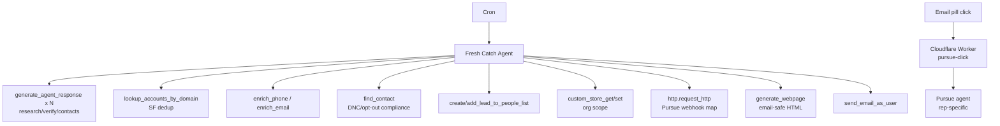
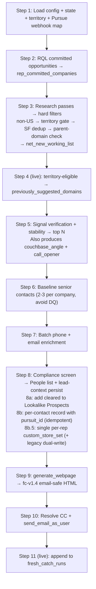

# 🎣 Fresh Catch — Technical Design Document

2026-09-16 · @u_oYMPV326oShi3ZruCZsG4w

Agent: Fresh Catch (Prod). Owner: Mel Boulos (mel.boulos@couchbase.com). Kind: Rox Agentflow. Instruction spec version aligns with design\_spec\_version = fc-v1.4 (email design lock). Trigger: cron `9 8 * * 1,3,5` in America/New\_York (Mon/Wed/Fri, 8:09 AM ET).

This document covers Fresh Catch only. The Pursue agent — which owns deep person research, customer-reference evidence, and email drafting after the 🎯 Pursue pill is clicked — has its own separate design doc; the two shared contracts (ownership boundary and pill/webhook integration) are mirrored between both docs.

## 1. Purpose

Fresh Catch is the daily New Logo prospecting agent for Couchbase sellers. Every scheduled run, per rep, it produces an email-first, ready-to-call brief containing:

- Net-new US companies (not already in Salesforce/Rox) that look like Couchbase's won customers
- Verified, sourced Couchbase-relevant selling signals
- Category-level Couchbase angles and call openers
- 2–3 senior contacts per company with phone + email + LinkedIn
- Feedback pills to teach the next run's taste
- (Live only, per-rep) a 🎯 Pursue pill that hands off the exact persisted lead context to the rep's Pursue agent for personalized email drafting

Design principle: quality over quantity. If nothing meets the bar on a given day, the email is short — or empty — by design.

## 2. Scope and non-goals

**In scope:** New Logo prospecting; territory fencing by the Mississippi River (New Logo only); Lookalike Prospects People list writes; per-rep lead-context persistence for downstream Pursue handoff.

**Not in scope (owned by Pursue or elsewhere):** deep person research, LinkedIn history mining, signal-progression tracking; Couchbase customer-reference research and customer-name inclusion in outreach copy (evidence-gated: DIRECT\_MATCH / PARTIAL\_MATCH / NO\_MATCH + one-example-max); email regeneration from persisted context; existing account, expansion, renewal, customer, and opportunity workflows; Prism territory logic (Prism trusts the Fresh Catch handoff).

## 3. System context



## 4. Trigger and identity

Trigger: `cron_schedule`, expression `9 8 * * 1,3,5`, resolved in America/New\_York. Identity model: the workflow runs per user — each enabled seller runs it as themselves. `{{ metadata.user.email }}` is the running rep. `is_live_run` = `preview_mode == false AND ui_test_mode == false`. Trigger type is never used to determine live vs. test (Rox test runs can simulate cron).

## 5. Modes of operation

Precedence: peek > ui\_test > preview > live.

| Mode | Variable | Persists state? | Sends email? | Researches? | Renders 🎯 Pursue? |
| --- | --- | --- | --- | --- | --- |
| Peek | `peek_mode=true` AND trigger ≠ cron | Read-only diagnostic | No | No | No |
| UI test | `ui_test_mode=true` | No | Yes (hardcoded sample) | No | No |
| Preview | `preview_mode=true` | No | Yes | Yes | No |
| Live | both flags false | Yes | Yes | Yes | Per-rep, gated |

**Peek mode** short-circuits before all other logic: reads the per-rep lead-context key (or legacy fallback), optionally filtered by `peek_domain`, dumps matching entries as a fenced JSON block, and stops. Ignored during a real cron run (safety).

**UI test mode** skips Steps 1–8 entirely, uses a hardcoded 3-company sample, generates HTML through Step 9, sends via Step 10 with subject prefix `[UI TEST]`. For design-lock validation without spending research/enrichment credits.

**Preview mode** runs the full pipeline including the territory fence, generates and emails the report, but writes nothing to org state and prefixes the subject with `[TEST]`. The territory fence still applies — an unmapped rep sees zero candidates.

**Live mode** persists everything, adds leads to the Lookalike Prospects People list, and renders the per-rep 🎯 Pursue pill when the rep is in the Worker's webhook map.

## 6. Configuration and state

All shared state uses org scope in the custom store.

### 6.1 Org-scoped config: `fresh_catch_config`

Single map holding all tunable knobs, loaded once at Step 1. Every knob has an in-instructions default.

| Key | Default | Purpose |
| --- | --- | --- |
| `fit_threshold` | 7 | Minimum Couchbase fit score (1–10) |
| `final_count` | 10 | Companies to include in the final brief |
| `min_candidates_target` | 25 | Minimum net-new working list size before stopping research passes |
| `max_research_passes` | 5 | Cap on Step 3 iterations |
| `signal_recency_days` | 90 | Signals older than this are downweighted |
| `feedback_opportunity_weight` | 5 | Multiplier of 🔥 More-like-this vs 👍 Good |
| `feedback_lookback_days` | 90 | Non-opportunity feedback retention |
| `email_subject_template` | 🎣 Fresh Catch  {N} leads · {M} companies · call {top\_company} first | Subject template |
| `icp_a_extra` / `icp_a_exclude` | \[\] | Overrides for ICP-A default list |
| `icp_b_extra` / `icp_b_exclude` | \[\] | Overrides for ICP-B default list |
| `new_logo_territories` | See §4 DEFAULT | East/West rep assignment |
| `config_version` | "default" | Version tag stored in run metadata |

### 6.2 Other org-scoped keys

| Key | Shape | Owner | Purpose |
| --- | --- | --- | --- |
| `previously_suggested_domains` | list\[str\] | Fresh Catch | Deduplicates across runs; only territory-eligible domains are appended |
| `fresh_catch_feedback` | list\[dict\] | External Worker | Rep clicks on 👍/🔥/🚫/👎; Fresh Catch reads only |
| `lookalike_prospects_list_id` | str | Fresh Catch | ID of the org's Lookalike Prospects People list; auto-created on first run |
| `support_by_rep` | dict\[str, list\[str\]\] | Manual | Rep-email → CC list for their Fresh Catch email |
| `fresh_catch_runs` | list\[dict\] | Fresh Catch | Per-run metadata log |
| `fresh_catch_lead_context:{rep_email_lower}` | dict\[pursuit\_id, record\] | Fresh Catch + Pursue | Per-rep persisted lead context (partitioned by field ownership) |
| `fresh_catch_lead_context` (legacy, no suffix) | Same shape | Migration only | Read-only fallback during migration; dual-written during migration; retired once all reps have run under the per-rep spec |

### 6.3 Workflow variables

| Variable | Type | Default | Purpose |
| --- | --- | --- | --- |
| `feedback_webhook_url` | str | https://melboulos.github.io/fresh-catch-feedback/ | Base URL for feedback pills |
| `preview_mode` | bool | false | Enables preview run |
| `ui_test_mode` | bool | false | Enables UI test mode |
| `peek_mode` | bool | false | Enables read-only diagnostic |
| `peek_domain` | str | "" | Optional domain filter for peek |
| `peek_rep_email` | str | "" | Optional rep override for peek |

## 7. New Logo geographic territory fence

A HARD ELIGIBILITY GATE, not a scoring or ranking factor. Fresh Catch IS the New Logo flow, so the fence applies to every candidate.

### 7.1 Dividing line

The Mississippi River itself. Regional shorthand (East Coast, West Coast, Census regions, time zones) and state-abbreviation-alone classification are explicitly forbidden. Use each company's primary US corporate headquarters — never incorporation state, registered agent, mailing address, subsidiary, sales office, or contact location.

### 7.2 Configuration

Assignment lives at `fresh_catch_config.new_logo_territories`:

```json
{
  "east": { "reps": ["josh.boulos@couchbase.com", "nate.beck@couchbase.com", "mel.boulos@couchbase.com"] },
  "west": { "reps": ["wendy.litwak@couchbase.com", "jessica.buuveibaatar@couchbase.com", "tinei.tuitoelau@couchbase.com"] }
}
```

Adding, removing, or moving a rep is a config change — no instruction edit. This DEFAULT is baked into the instructions and applies when config is missing or malformed.

### 7.3 Defensive normalization

Trim, lowercase, drop empty/null/non-string/no-`@`, dedupe within each side. A rep listed on BOTH sides is removed from BOTH (fail-closed guard against config typos) and logged to `territory_rep_in_both_sides`.

### 7.4 Running rep's territory (Step 1.9)

Runs unconditionally in all modes except UI test. Matches `metadata.user.email` (trimmed, lowercased) against normalized `east.reps` / `west.reps` → yields `east` | `west` | `none`.

### 7.5 Fail-closed policy (Step 3 gate)

Applied before the SF dedup batch check — territory rejection is cheaper than the dedup call, so rejected candidates never trigger any downstream tool call, Step 4 persistence write, Step 5 signal/stability verification, Step 6 contact research, Step 7 enrichment, or Step 8 compliance/lead-context write. REJECT when any of:

- `running_rep_territory == "none"` → reject ALL New Logo candidates for that rep, counted under `territory_rejected_no_rep_territory`
- `hq_side_of_mississippi == "unknown"` → REJECT
- `hq_side_of_mississippi == "ambiguous"` (river-adjacent cities, island HQ, state on both sides) → REJECT
- `hq_side_of_mississippi != running_rep_territory` → REJECT
- Otherwise → KEEP, add to `territory_eligible_this_run`

### 7.6 Persistence exclusion

Territory-rejected, unknown-geography, and ambiguous-geography domains are excluded from `previously_suggested_domains`. Rationale: territory assignments can change; persisting a reject would permanently hide the candidate from a rep who becomes eligible later.

### 7.7 No padding

The fence never causes list padding. If fewer than `effective_final_count` candidates survive, send fewer.

### 7.8 Researcher prompt rules (Step 3)

Every candidate the researcher returns must include `hq_city_state` (unknown when not establishable) and `hq_side_of_mississippi` (east | west | ambiguous | unknown). The prompt requires: use PRIMARY US corporate HQ only; a non-exhaustive list of ambiguous river cities (New Orleans, Baton Rouge, Memphis, St. Louis, Minneapolis, St. Paul, Davenport, Rock Island, Bettendorf, Moline, La Crosse, Dubuque, Quincy, Cape Girardeau, Natchez, Vicksburg); never classify from state abbreviation alone when the state sits on both sides of the river; return `unknown` when HQ can't be established with confidence — do not spend research effort disambiguating.

## 8. Fresh Catch ↔ Pursue ownership boundary (FROZEN)

*Mirrored in the Pursue design doc — update both sides together.*

Both agents share one record per contact, keyed by `pursuit_id`.

**8.1 Fresh Catch-owned fields** (written on every live run): `pursuit_id`, `run_id`, `rep_email`, `run_date`, `account.*` (name, domain, fit\_score, tier, most\_similar\_to), `signal.*` (emoji, headline, source\_name, date, url), `why_now`, `couchbase_angle` (category-level only, no customer names), `implication`, `call_opener` (no customer names), `contact.*` (name, title, email, phone, linkedin\_slug), `status` (initialized to `open` on new records; preserved if already drafted or sent).

**8.2 Pursue-owned fields:** `why_you`, `customer_evidence.*` (qualification, customer\_name, use\_case, relevance, source\_url), `conversation_thesis`, and `status` transitions `open → drafted → sent`. All Couchbase customer-reference research lives here — Fresh Catch never names a customer in `couchbase_angle` or `call_opener`.

**8.3 Same-day rerun contract:** on idempotent rerun (same rep + domain + contact + run\_date), Fresh Catch reuses the existing `pursuit_id`, refreshes only its own fields, and preserves everything Pursue may have written. `drafted` and `sent` are never clobbered back to `open`.

## 9. Storage Contract — per-rep lead-context keys

Primary key: `fresh_catch_lead_context:{rep_email_lower}` — one source of truth per rep, preventing concurrent runs from clobbering each other's map.

Legacy key: `fresh_catch_lead_context` (no suffix) — read-only fallback during migration. Fresh Catch never writes fresh records to legacy; it dual-writes the merged map to legacy only when the current run fell back to legacy on read. Retired once every active rep has completed one run under the per-rep spec.

`pursuit_id` format: `fc-{YYYYMMDD}-{rep_initials}-{6-random-alphanumeric}`. Rep initials in the ID + physical key sharding = both logical and physical isolation across reps.

Read pattern (Step 1.7, live only): per-rep key first → legacy fallback (filtered to current rep) → empty. Tracked as `lead_context_read_source`.

Write pattern (Step 8b.5): always write the full merged map to the per-rep key; dual-write to legacy if the read fell back to legacy.

Retention: 30 days. Purge (DELETE, not mark) at the start of each live run.

Idempotency: rep + domain + contact\_email + run\_date reuses the existing `pursuit_id` and preserves Pursue-owned fields.

## 10. Integration Contract — 🎯 Pursue pill URL (FROZEN)

*Mirrored in the Pursue design doc — update both sides together.*

Every 🎯 Pursue pill href must be:

```
https://rox-deep-dive-proxy.mel-boulos-97e.workers.dev/pursue-click?pursuit_id={pursuit_id}&rep_email={rep_email_urlencoded}&contact_email={contact_email_urlencoded}
```

Rules: host + path are frozen — never link the pill directly to `https://webhooks.backend.rox.com/...` (Rox webhooks are POST-only; email clicks are GET; direct-to-Rox returns `{"message":"Not Found"}` on click). `pursuit_id` is the exact persisted ID from `contact_to_pursuit_id` (Step 8b), never regenerated during HTML rendering. `rep_email` = `{{ metadata.user.email }}` lowercased, URL-encoded. `contact_email` = URL-encoded contact email, omitted entirely for LinkedIn-only contacts. No `test=1` — Pursue is live-only, never rendered in preview/UI test.

The Worker validates params, looks up the rep's Pursue webhook URL by `rep_email` (via org admin KV), signs the POST if a signing key is configured, forwards to the rep's Pursue instance, and returns an HTML confirmation page.

**Rendering rules:** the pill appears on a contact row only when ALL are true — `is_live_run == true`, the current rep is in the Worker's `/pursue-webhooks.json` map, and the contact has a `pursuit_id`. Otherwise silently omit (no placeholder, no disabled pill).

**Persistence independence:** Fresh Catch writes lead context for every compliance-cleared contact regardless of whether the rep is currently mapped for Pursue — Pursue can be enabled for a rep later without re-running Fresh Catch.

## 11. Execution steps

**Step 1 — Load config and state**

1. Load `fresh_catch_config`, extract effective knobs.
2. Load `previously_suggested_domains` (org scope; one-time migration from workflow scope if org key empty).
3. (Folded into step 2.)
4. Load and process `fresh_catch_feedback` → `liked_domains`, `opp_domains`, `blocked_domains`, `dq_contacts`; count `feedback_signals_used`.
5. Load `lookalike_prospects_list_id`.
6. Load and normalize `support_by_rep`.
7. Load and prune (30-day retention) `fresh_catch_lead_context:{rep_email_lower}` per §9 read pattern. Live only.
8. Fetch Pursue webhook map from `https://rox-deep-dive-proxy.mel-boulos-97e.workers.dev/pursue-webhooks.json`. Live only. Failures → treat map as empty, log `pursue_map_fetch_error`, never fail the run.
9. Compute `running_rep_territory` (§7.4). All modes except UI test.

**Step 2 — Query committed opportunities for territory anchor.** RQL query against the deal object for the rep's committed forecast-stage opportunities, capped \~15 rows. Adds the rep's territory pattern as an additional anchor, never a replacement for ICP. Sets `anchor_mode = rep+icp | icp_only | rql_failed`.

**Step 3 — Gather qualified net-new candidate companies.** Up to `effective_max_research_passes` calls to `generate_agent_response`, each requesting ≥ `effective_min_candidates_target` candidates with fields: `company_name`, `domain`, `us_based`, `hq_location`, `hq_city_state`, `hq_side_of_mississippi`, `rationale`, `most_similar_to`, `similar_tier` (A/B/REP), `couchbase_fit_score`, `couchbase_fit_reason`.

Hard filters after each pass, in order: drop non-US → drop below `effective_fit_threshold` → TERRITORY GATE (§7.5, adds survivors to `territory_eligible_this_run`) → batch SF dedup via `lookup_accounts_by_domain` (survivors only) → parent-domain check (strip common suffixes like connect/cloud/pay/pharmacy/logistics; if ≥ 4 chars remain, batch-check parent; a parent hit = SF dup noted `dup_via_parent:{parent_domain}`) → survivors go to `net_new_working_list`. Stop when `net_new_working_list ≥ effective_min_candidates_target` or passes exhausted.

**Step 4 — Persist scored domains (live only).** Append `territory_eligible_this_run` domains to `previously_suggested_domains`. Territory-rejected/unknown/ambiguous domains are never persisted. Preview mode skips entirely.

**Step 5 — Verify signals + corporate stability.** One `generate_agent_response` call for all candidates, returning per candidate: a primary verified selling signal (source name, date, URL; fabrication forbidden; null when none exists) and a corporate stability check (`is_stable`, `instability_type`, dated source — only marks unstable with a named, dated, credible source; rumors keep the candidate). Drop signal-less and unstable candidates, sort by fit score desc (tiebreak A > B > REP), take top `effective_final_count`. Also produces category-level `couchbase_angle` and `call_opener` (no customer names).

**Step 6 — Research senior contacts (baseline only).** One `generate_agent_response` call for all final companies: 2–3 senior contacts each (VP/Director/Head in Engineering, Data, Product, Platform, Mobile, Cloud, Architecture, AI, or Infrastructure), excluding matching `dq_contacts`. Baseline discovery only — deep person research is Pursue's job.

**Step 7 — Enrich contacts.** `enrich_phone` batch, then `enrich_email` batch as backup. Never per-person.

**Step 8 — Compliance screen, create leads, persist lead context.** Per contact: skip if in `dq_contacts` (by domain+email or domain+LinkedIn slug); `find_contact` (email preferred, LinkedIn fallback); block if `do_not_call`/`do_not_contact`/`opt_out_email` is true, or if `find_contact` errors (fail-safe). Compute `leads_count_for_card` per company.

- **8a (live only):** resolve or auto-create the Lookalike Prospects People list; `add_lead_to_people_list` for cleared contacts with phone or email.
- **8b (live only, `final_companies_count > 0`):** per §9/§8, compute contact identity key (`{rep}|{domain}|{email or linkedin:slug}|{run_date}`); reuse `pursuit_id` and preserve status on a match; otherwise generate a fresh `pursuit_id`, status `open`, populate FC fields only. Retain `contact_to_pursuit_id` for Step 9 pill rendering.
- **8b.5:** one `custom_store_set` to the per-rep key with the full merged map; dual-write to legacy if the read fell back to legacy.

**Step 9 — Generate the email-first call sheet** (design lock fc-v1.4, see §12). Rendered via `generate_webpage` with `save_to_homepage="save"`.

**Step 10 — Email report.** Resolve CC list from `support_by_rep` with 10-rule defensive normalization (lowercase keys/values, coerce string → list, drop non-email items, filter self-CC, dedupe, never invent entries, never fail on exception). `send_email_as_user` with subject built from `effective_email_subject_template`, prefixed `[UI TEST]` or `[TEST]` in non-live modes.

**Step 11 — Log run metadata (live only).** Append to `fresh_catch_runs` (see §14).

## 12. Email design lock (fc-v1.4)

Every Fresh Catch email must render identically; only data varies. Nine top-level sections, exact order: wrapper (max-width 640, page bg #F5F7FB) → preview banner (conditional) → headline row (🎣 Fresh Catch, 26px/700) → subtitle (2 sentences; personalization sentence conditional on `feedback_signals_used > 0`) → stat tiles (Leads, Companies, conditional Compliance blocked, conditional Instability filtered) → "WHAT THIS AGENT DOES" 2×2 grid (frozen copy) → CALL TARGETS section label → company cards (top-ranked first) → footer (conditional preview paragraph + 4 always-on centered lines including `design_spec_version=fc-v1.4`).

Each company card has 8 fixed sub-blocks a–h: (a) header — name + domain, Fit pill + leads chip; (b) similar-to line; (c) signal block (emoji + headline + evidence line); (d) Couchbase angle block (no customer names); (e) call opener block (📞 Say this on the call:); (f) contacts, per-row `data-pursuit-id` attribute, optional 🎯 Pursue pill + always 👎 DQ pill; (g) feedback preamble; (h) account-level buttons (👍 Good account, 🔥 More like this, 🚫 Never suggest).

Design tokens: frozen palette, Gmail-safe (`<table role="presentation">`, inline styles, no `<style>`, no external images, no web fonts, no flex/grid, no hover states, no media queries).

Button label rules (FROZEN, emoji is visible text): 👍 Good account, 🔥 More like this (URL param stays `type=opportunity` for backward compatibility), 🚫 Never suggest, 👎 DQ, 🎯 Pursue.

Zero-lead special case: single 🎣 No qualifying leads today. card, with sub-line reason — 5 allowed examples: signal verification, SF dedup, corporate instability, outside territory, no configured territory. Still emits the personalization line (if applicable) and the full 4-line footer.

Hard prohibitions: no executive summary, TOC, playbook, funnel dashboard, methodology/appendix, colored left-bordered boxes, invented button colors/labels, dropped emojis, 🎯 on any feedback button, disabled/greyed Pursue pill, direct-to-Rox Pursue URL, missing `data-pursuit-id` attribute, missing/reworded footer lines, Couchbase customer names in `couchbase_angle` or `call_opener`.

Design changes are only made by editing the instructions and bumping `design_spec_version` — never mid-run.

## 13. Selling signal palette and quality bar

Signal emoji palette (Step 9 headline prefix): 💰 funding, 📈 growth, 🚀 launch, 👥 hiring/leadership, 🏗️ infrastructure modernization, 🤝 partnership/M&A, 🎯 strategy pivot, 💡 AI/innovation. (🎯 here is a signal-palette entry, distinct from the per-contact 🎯 Pursue action button.)

Quality bar for the final list: US-based + net-new + fit ≥ threshold + verified signal + corporate-stable + standalone corporate identity (no subsidiaries) + in the running rep's territory. Never pad the list.

Corporate instability disqualifiers (180-day window): M&A activity, rebrand/rename, bankruptcy/insolvency, major restructuring, layoffs > 20%, loss of primary business, going-private. Verified with a named, dated, credible source; unverified rumors keep the candidate.

Subsidiary guard (two layers): researcher prompt AVOID list (walmartconnect.com, disneyparkstechnology.com, googlecloud.com, applepay.com, microsoftazure.com, linkedintalent.com, etc.); parent-domain suffix-strip check in Step 3 hard filters. Full-spinoff exceptions (kyndryl.com, carrier.com) are OK.

## 14. Telemetry (`fresh_catch_runs` entries, live only)

Per-run fields: identity (run date, rep, run\_id); config (`config_version`, `design_spec_version` — always fc-v1.4 — all `effective_*` knobs); anchor (`anchor_mode`, `committed_opps_count`); funnel (candidates researched, cleared fit bar, `sf_dedup_hits_direct`, `parent_domain_dup_count`, non-US drops, low-fit drops, passes used, `signals_dropped`, `instability_dropped` + list with `instability_type`/source, `compliance_blocks`, `dq_contacts_skipped`); output (`final_companies_count`, `leads_count_for_card` per company, `top_company`); feedback (`feedback_signals_used`); lead context (`lead_context_records_written`, `_created`, `_updated`, `_expired_purged`, `lead_context_read_source`, `lead_context_write_key_per_rep`, `lead_context_write_key_legacy`); Pursue (`pursue_webhook_mapped_for_rep`, `pursue_pills_rendered`, `pursue_map_fetch_error`); territory (`running_rep_territory`, `territory_rejected_out_of_territory`, `territory_rejected_unknown`, `territory_rejected_ambiguous`, `territory_rejected_no_rep_territory`, `territory_rejection_events`, `territory_rep_in_both_sides`).

Per-candidate territory rejection event shape (no PII):

```json
{
  "event": "territory_rejected",
  "domain": "example.com",
  "hq_location": "City, ST" or "unknown",
  "territory": "east" or "west" or "none",
  "running_rep": "rep@couchbase.com",
  "reason": "territory_rejected" or "unknown_geography" or "ambiguous_geography" or "no_rep_territory"
}
```

## 15. Attached actions

| Package | Action | Used in |
| --- | --- | --- |
| agent\_outputs | `generate_agent_response` | Steps 3, 5, 6 |
| agent\_outputs | `generate_webpage` | Step 9 |
| rox\_actions | `lookup_accounts_by_domain` | Step 3 (SF dedup + parent-domain check) |
| rox\_actions | `find_contact` | Step 8 (compliance screen) |
| rox\_actions | `enrich_person_details` | Available, currently unused |
| rox\_actions | `enrich_phone` | Step 7 |
| rox\_actions | `enrich_email` | Step 7 |
| rox\_actions | `create_people_list` | Step 8a (first-run bootstrap) |
| rox\_actions | `add_lead_to_people_list` | Step 8a |
| rox\_actions | `custom_store_get` | Step 1, 1.7 |
| rox\_actions | `custom_store_set` | Steps 4, 8b.5, 11 |
| email | `send_email_as_user` | Step 10 |
| http | `request_http` | Step 1.8 (Pursue webhook map fetch) |

RQL (data query) tools are runtime built-ins — not attached — used in Step 2.

## 16. Runtime settings

`timezone`: America/New\_York. `run_name`: `🎣 Fresh Catch — {{ metadata.run.triggered_at }}`. `create_task_items`: true (Step 9's `generate_webpage` uses `save_to_homepage="save"`).

## 17. Failure-mode taxonomy

| Failure | Handling | Never fails the run? |
| --- | --- | --- |
| `fresh_catch_config` missing | Use in-instructions defaults | Yes |
| `new_logo_territories` malformed | Fall back to DEFAULT | Yes |
| Rep on both sides of `new_logo_territories` | Remove from BOTH, log `territory_rep_in_both_sides` | Yes |
| Rep not in either side | `running_rep_territory = "none"` → reject all candidates, zero-lead email sent | Yes |
| Pursue webhook map fetch fails | Treat map as empty (no pill anywhere), log `pursue_map_fetch_error` | Yes |
| `support_by_rep` malformed | Treat CC list as empty, still email the AE | Yes |
| RQL query fails (Step 2) | Retry via catalog search, then `anchor_mode = "rql_failed"` | Yes |
| `find_contact` errors | Block the contact (fail-safe) | Yes |
| Lookalike Prospects list write permission-denied | Auto-create new list | Yes |
| Instability signal unverified | KEEP the candidate (never fail-open reject) | Yes |
| Signal fabrication | Return null (Step 5), drop the candidate | Yes |
| `hq_side_of_mississippi` unknown/ambiguous | REJECT (never guess, never spend tokens disambiguating) | Yes |

## 18. Data-flow diagram



## 19. Sharing model

Fresh Catch is a per-user cron-triggered agent. When shared, each rep enables it from their own view and it runs in their own context with their own data — one rep enabling it doesn't enable it for others. This is why `{{ metadata.user.email }}` already resolves to the running rep with no hardcoded identity needed; the territory fence uses the running rep's email to compute eligibility; lead-context keys are sharded per rep; the Pursue pill is per-rep gated by the Worker's map; and feedback history is filtered to the current rep for account feedback (DQ contacts are org-wide).

## 20. Acceptance test matrix (territory fence)

| # | Test | Enforced by |
| --- | --- | --- |
| 1 | East rep + East HQ → PASS | Step 3 territory gate keep-branch |
| 2 | East rep + West HQ → REJECT (no downstream, no persist, no Prism) | Step 3 gate + Step 4 filter + Prism-boundary rule |
| 3 | West rep + West HQ → PASS | Step 3 keep-branch |
| 4 | West rep + East HQ → REJECT | Step 3 gate + Step 4 filter |
| 5 | Unknown HQ → REJECT (no expensive downstream) | Step 3 gate |
| 6 | Ambiguous HQ → REJECT (no guess) | Step 3 gate + researcher ambiguous rules |
| 7 | Rep missing from config → REJECT ALL | Step 1.9 "none" + Step 3 first branch |
| 8 | Territory reassignment → prior reject stays eligible | Step 4 persistence exclusion |
| 9 | Insufficient candidates → send fewer, don't pad | §7 No padding |
| 10 | Add West rep via config → no instruction change | Config-driven normalization |
| 11 | Add East rep via config → no instruction change | Config-driven normalization |
| 12 | State crossed by river → classified by actual HQ | Researcher prompt + ambiguous fallback |
| 13 | HQ on/near boundary → REJECT as ambiguous | Researcher ambiguous rules + Step 3 gate |

## 21. Locked contracts (never regress)

- Fresh Catch vs. Pursue ownership boundary (§8) — field-level split
- Storage Contract (§9) — per-rep keys, migration dual-write
- Integration Contract (§10) — Worker URL for 🎯 Pursue pill
- Design Lock fc-v1.4 (§12) — email structure, tokens, copy
- New Logo geographic territory fence (§7) — hard eligibility gate

Any change to these is a spec-version bump, not a mid-run tweak.

## 22. Current rep assignment

| Rep | Territory | Source |
| --- | --- | --- |
| Josh Boulos | East | DEFAULT (instructions) |
| Nate Beck | East | DEFAULT (instructions) |
| Mel Boulos | East | DEFAULT (instructions) |
| Wendy Litwak | West | DEFAULT (instructions) |
| Jessica Buuveibaatar | West | DEFAULT (instructions) |
| Tinei Tuitoelau | West | DEFAULT (instructions) |

Override any of the above by writing `fresh_catch_config.new_logo_territories` to the org-scoped custom store. Rep changes are then pure config edits with no instruction change.

## Sources

Based on the Fresh Catch implementation summary and full design spec provided directly by the user (no external sources fetched).
